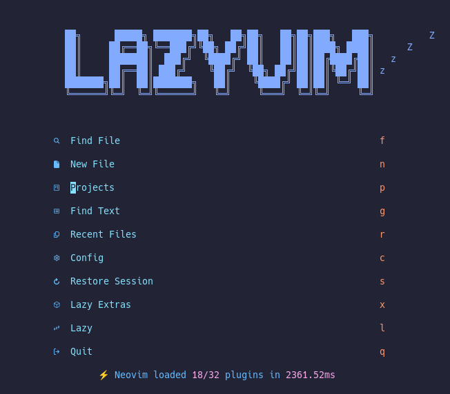

# Neovim

## Contents

- [Screenshot](#screenshot)
- [Requirements](#requirements)
- [Installation](#installation)

### Screenshot



### Requirements

- Neovim (version >= 0.7.0), run `nvim -v` to check neovim version.
- Exuberant Ctags and/or Universal Ctags.
- Ripgrep & Fd-find

### Installation

Backup your existing config first!

Step 1: Cleanup
```
rm -rf ~/.config/nvim ~/.cache/nvim ~/.local/share/nvim
```

Step 2: Clone & fetch
```
git clone git@gitlab.com:elnox/neovim.git ~/.config/nvim
cd ~/.config/nvim && git fetch origin
```

Step 3: Enjoy ;)
```
nvim
```
