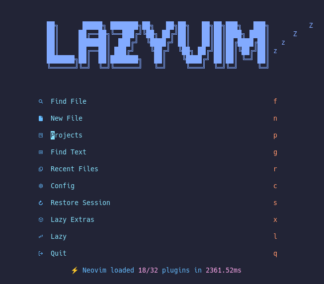

# Neovim

<!-- markdownlint-disable MD013 -->

## Contents

- [Screenshot](#screenshot)
- [Requirements](#requirements)
- [Installation](#installation)
- [Features](#features)

### Screenshot



### Requirements

- Neovim (version >= 0.11.0), run `nvim -v` to check neovim version.
- Python3 / Nodejs / Npm / Ripgrep / Fd-find / Xclip
- Exuberant Ctags or Universal Ctags.

```bash
# Pynvim
apt install python3-pynvim

# Nodejs & npm
curl -o- https://raw.githubusercontent.com/nvm-sh/nvm/v0.40.3/install.sh | bash
nvm install node

# Utils
apt install ripgrep fd-find xclip ncdu universal-ctags
```

### Installation

Backup:

```bash
bash <(curl -s https://gitlab.com/elnox/neovim/-/raw/master/utils/install) --bakup master
```

Install:

```bash
bash <(curl -s https://gitlab.com/elnox/neovim/-/raw/master/utils/install) \
    --release stable --config master
```

Cleanup:

```bash
rm -rf ~/.config/nvim ~/.cache/nvim ~/.local/nvim ~/.local/share/nvim ~/.local/state/nvim
```

Restore:

```bash
bash <(curl -s https://gitlab.com/elnox/neovim/-/raw/master/utils/install) --restore master
```

### Features

#### Core UI

| Icon | Plugin                          | Description                                                                     |
| ---- | ------------------------------- | ------------------------------------------------------------------------------- |
| 🗂   | `akinsho/bufferline.nvim`       | Tab & buffer line management with icons and separators.                         |
| 📊   | `nvim-lualine/lualine.nvim`     | Customizable statusline, with git, diagnostics, mode, date, and DAP info.       |
| 💬   | `folke/noice.nvim`              | Enhanced Neovim UI for messages, cmdline, and popupmenu.                        |
| 🖼   | `nvim-mini/mini.icons`          | Filetype and filename icons for buffers, tabs, and dashboard.                   |
| 🧩   | `MunifTanjim/nui.nvim`          | UI component library for building popup menus, layouts, and custom UI elements. |
| 🥪   | `folke/snacks.nvim`             | A collection of QOL plugins like file explorer, notifications and more.         |
| 🌅   | `goolord/alpha-nvim`            | Startup screen / dashboard with recent files, quick links, and stats.           |
| 🌀   | `yuttie/comfortable-motion.vim` | Smooth scrolling for a more visually comfortable experience.                    |

#### Core Editor

| Icon | Plugin                     | Description                                                                  |
| ---- | -------------------------- | ---------------------------------------------------------------------------- |
| 🔍   | `MagicDuck/grug-far.nvim`  | Multi-file search and replace with configurable headers.                     |
| ⚡   | `folke/flash.nvim`         | Jump to any position in the buffer using visible labels.                     |
| ⌨️   | `folke/which-key.nvim`     | Displays keybinding hints for commands, registers, marks, and custom groups. |
| 🌿   | `lewis6991/gitsigns.nvim`  | Git integration: buffer signs, staged changes, and live updates.             |
| 📝   | `folke/trouble.nvim`       | Diagnostics, references, and quickfix list in a clean UI.                    |
| 🛠️   | `folke/todo-comments.nvim` | Highlights TODO/FIX/HACK/NOTE/PERF comments with icons and colors.           |
| 🔌   | `akinsho/toggleterm.nvim`  | Integrated floating terminal with multiple terminal toggles.                 |

