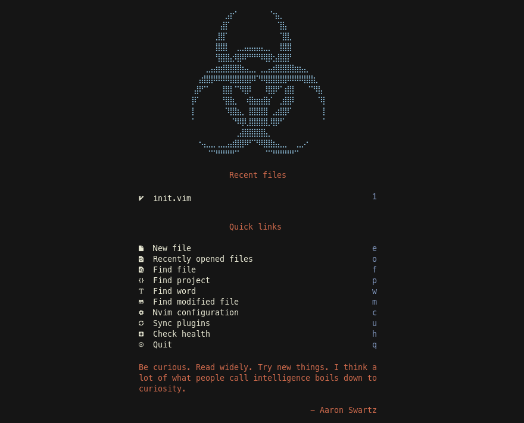

# Neovim

## Contents

- [Screenshot](#screenshot)
- [Requirements](#requirements)
- [Installation](#installation)
- [Mappings](#mappings)

### Screenshot



### Requirements

- Neovim (version >= 0.8.0), run `nvim -v` to check neovim version.
- Python3 / Nodejs / Npm / Ripgrep / Fd-find
- Exuberant Ctags and/or Universal Ctags.
- Ncdu / Htop / Lazygit

### Installation

Backup your existing config first!

Step 1: Cleanup
```
rm -rf ~/.config/nvim ~/.cache/nvim ~/.local/share/nvim
```

Step 2: Clone & fetch
```
git clone https://gitlab.com/elnox/neovim.git ~/.config/nvim
cd ~/.config/nvim && git fetch origin
```

Step 3: Enjoy ;)
```
nvim
```

Or if you know what you are doing:
```
bash <(curl -s https://gitlab.com/elnox/neovim/-/raw/master/utils/install) \
    --release nightly --config master
```
### Mappings

Leader command: \<space>

**Windows**

| Mode  | Mapping        | Action                  | Alternative     |
| --    | ---            | ---                     | --              |
| n     | C-w-Up         | Goto up window          | C-w-k           |
| n     | C-w-Down       | Goto down window        | C-w-j           |
| n     | C-w-Right      | Goto right window       | C-w-l           |
| n     | C-w-Left       | Goto left window        | C-w-h           |
| n     | leader-/       | Split horizontally      | :split          |
| n     | leader-!       | Split vertically        | :vsplit         |

**Buffers**

| Mode  | Mapping        | Action                  | Alternative      |
| --    | ---            | ---                     | --               |
| n     | leader-n       | Open new                | :enew            |
| n     | leader-Right   | Goto next               | :bnext           |
| n     | leader-Left    | Goto prev               | :bprev           |
| n     | C-Up           | Scroll backward         |                  |
| n     | C-Down         | Scroll forward          |                  |
| n     | C-b            | Scroll backward (-200)  |                  |
| n     | C-f            | Scroll forward (+200)   |                  |
| n     | leader-w       | Save file               | :write           |
| n     | leader-c       | Close file              | :quit            |
| n     | C-c            | Copy whole file         | :%y+             |

**Tabs**

| Mode  | Mapping        | Action                  | Alternative      |
| --    | ---            | ---                     | --               |
| n     | C-t            | New tab                 | :tabnew          |
| n     | C-PageUp       | Goto next               | :tabnext         |
| n     | C-PageDown     | Goto prev               | :tabprev         |

**Toggling**

| Mode  | Mapping        | Action                  | Alternative      |
| --    | ---            | ---                     | --               |
| n     | F1             | Alpha                   | :Alpha           |
| n     | F2             | Nvim tree               | :NvimTreeToggle  |
| n     | F3             | Tag bar                 | :TagbarToggle    |
| n     | F4             | Aerial                  | :AerialToggle    |
| n     | F5             | Mason                   | :Mason           |
| n     | F6             | Null ls info            | :NullLsInfo      |

**Searching**

| Mode  | Mapping        | Action                  | Alternative      |
| --    | ---            | ---                     | --               |
| n     | fb             | Buffers                 | leader-b         |
| n     | ff             | Files                   | leader-f         |
| n     | fp             | Projects                | :Tel projects    |
| n     | fg             | Live grep               | :Tel live_grep   |
| n     | fn             | Notifications           | :Tel notify      |
| n     | fo             | Changed                 | :Tel git_status  |
| n     | fs             | Color schemes           | :Tel colorscheme |
| n     | fc             | Commands                | :Tel commands    |
| n     | fk             | Keymaps                 | :Tel keymaps     |
| n     | fm             | Man pages               | :Tel man_pages   |

**Language Server Protocol**

| Mode  | Mapping        | Action                  | Alternative      |
| --    | ---            | ---                     | --               |
| n     | l?             | Hover doc               | ?                |
| n     | la             | Code action             | ga               |
| n     | ld             | Goto definition         | gd               |
| n     | lD             | Goto declaration        | gD               |
| n     | lf             | Format buffer           | gf               |
| n     | lh             | Signature helper        | gn               |
| n     | li             | Goto implementation     | gi               |
| n     | ln             | Goto next diagnostic    | dn               |
| n     | lo             | Open Diagnostic         | do               |
| n     | lp             | Goto prev diagnostic    | dp               |
| n     | lr             | Get references          | gr               |
| n     | ls             | Get symbols             | gs               |
| n     | lS             | Workspace symbols       | gS               |
| n     | lt             | Type definition         | gt               |
| n     | lw             | Workspace diagnostics   | dl               |

**Terminals**

| Mode  | Mapping        | Action                  | Alternative      |
| --    | ---            | ---                     | --               |
| n     | tg             | Lazygit                 |                  |
| n     | tn             | Node                    |                  |
| n     | tu             | Ncdu                    |                  |
| n     | tt             | Htop                    |                  |
| n     | tp             | Python                  |                  |
| n     | tf             | Term float              |                  |
| n     | th             | Term horizontal         |                  |
| n     | tv             | Term vertical           |                  |
